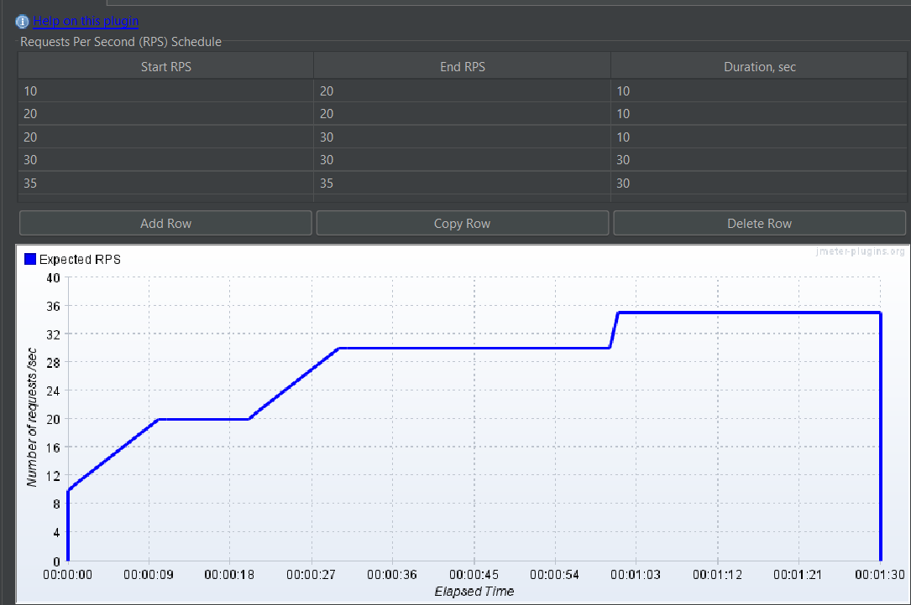

#  Perf-Test-Jmeter
## _Description_

## _Getting Started_
* [Download JMeter from Apache](https://jmeter.apache.org/download_jmeter.cgi)
* [Download crypto.js](https://jar-download.com/artifacts/org.webjars.npm/crypto-js/3.1.9-1/source-code) and put it in the jmeter/bin directory
* [Download the Plugins Manager JAR file]( https://jmeter-plugins.org/wiki/PluginsManager/) and put the file in the lib/ext directory
* add the following properties to jmeter/bin/user.properties
  ```
   urlOcaServer=oca.services.uat.tbst.me
   urlCisServer=cisqa1.services.uat.tbst.me
   urlCcsServer=
   pathJmeter={path to jmeter bin}/apache-jmeter-5.4.3/bin
  ```

## Packages & Directory structure

* cis 
 
* oca
* jms


## Run tests
* using command line
  - to execute test
  ```
    .\jmeter -n -t your_script.jmx -JurlOcaServer=(override properties urloca) -l (path-to-csv-result) 
  ```
  - to create report
   ````
   .\jmeter -g(path-to-csv-result) -o (path-output-folder-to-save-result)
  ````
